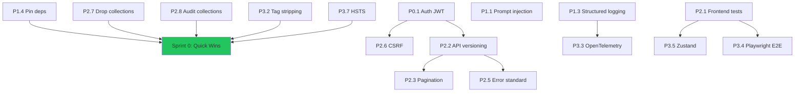

# Enterprise Remediation — Strategic Roadmap

**Baseline:** ~44% → Target: 80%+ Enterprise Ready
**Progress:** 24 of 26 Done (92%) | 2 Remaining
**Completed:** P0.1 ✅, P0.2 ✅, P0.3 ✅, P0.4 ✅, P1.1 ✅, P1.2 ✅, P1.3 ✅, P1.4 ✅, P1.5 ✅, P1.6 ✅, P2.1 ✅, P2.2 ✅, P2.3 ✅, P2.4 ✅, P2.5 ✅, P2.6 ✅, P2.7 ✅, P2.8 ✅, P3.1 ✅, P3.2 ✅, P3.3 ✅, P3.5 ✅, P3.6 ✅, P3.7 ✅
**Planning Method:** Opus Planning v3.0
**Last Updated:** 2026-02-11 (P3.1 Belief Decay Wiring completed)

---

## ✅ Confirmed Decisions

| # | Decision | Confirmed |
|---|----------|-----------|
| 1 | Auth approach | **JWT + API Key Dual Auth** |
| 2 | Backward-compatible migration | **Yes** — unauthenticated endpoints stay live for 1 sprint |
| 3 | Drop dead collections | **Yes** — `conversations_v2` + `cache` (after backup) |
| 4 | Execution start | **Sprint 0 quick wins first** |
| 5 | API versioning timing | **After auth** |

---

## ⚠️ Mandatory: Post-Task Documentation

> [!IMPORTANT]
> **ყოველი ტასკის დასრულების შემდეგ, სავალდებულოა შეავსო:**
> [`remediation_task_registry.md`](.agent/memory/remediation_task_registry.md)
>
> თითოეულ ტასკში უნდა დაფიქსირდეს:
> - **Status** — ტასკის სტატუსი (✅ Done / ⏳ Pending / 🔴 Blocked)
> - **Bugs Found** — რა ბაგები აღმოჩნდა
> - **What Changed** — რა შეიცვალა ორიგინალ გეგმასთან შედარებით
> - **Corrections** — რა გასწორდა და როგორ
> - **Files** — რომელ ფაილებში მოხდა ცვლილება
>
> **არცერთი ტასკი არ ითვლება დასრულებულად, სანამ ეს ფაილი არ განახლდება.**

---

## Sequential Execution Order

```
Step 1   ✅ Sprint 0: Quick Wins                    [Day 1]      DONE
Step 2   ✅ P0.1: JWT Auth (Deep Plan → Build)      [Week 1]     DONE
Step 3   ✅ P1.1: Prompt Injection Blocking          [Week 2]     DONE
Step 4   ✅ P1.5: Dockerfile Security                [Week 2]     DONE
Step 5   ✅ P1.6: CSP Headers                        [Week 2]     DONE
Step 6   → P1.3: Structured Logging                 [Week 2-3] ✅ DONE
Step 7   ✅ P1.2: Save Pipeline Retry                [Week 3]     DONE
Step 8   ✅ P2.6: CSRF Protection                    [Week 3]     DONE
Step 9   ✅ P2.2: API Versioning                     [Week 3]     DONE
Step 10  ✅ P2.5: Error Standardization               [Week 3]     DONE
Step 11  ✅ P2.1: Frontend Tests (Vitest)             [Week 3-4]   DONE
Step 12  ✅ P2.3: Pagination                          [Week 4]     DONE
Step 13  ✅ P2.4: SSE Auto-Reconnect                  [Week 4]     DONE
Step 14  ✅ P3.3: OpenTelemetry                        [Week 4]     DONE
Step 15  ✅ P3.5: Zustand State Management             [Week 4-5]   DONE
Step 16  ✅ P3.6: Bundle Optimization                  [Week 5]     DONE
Step 17  ✅ P3.1: Belief Decay Wiring                  [Week 5]     DONE
Step 18  ✅ P3.4: E2E Playwright Tests                 [Week 5]     DONE
Step 19  ✅ P3.8: Feature Flags                        [Week 5]     DONE
```

> **Critical Path:** Sprint 0 → Auth → Security Hardening → API → Tests → Polish

---

## Triage Matrix

| Task | Size | Risk | Planning Level | Status |
|------|------|------|----------------|
| ✅ **P0.1** Auth (JWT/API keys) | L (5-10 files) | CRITICAL | 🔴 DEEP | **DONE** |
| ✅ **P1.1** Prompt injection blocking | M (2-3 files) | HIGH | 🟠 FULL | **DONE** |
| ✅ **P1.2** Save pipeline retry | M (2-3 files) | MEDIUM | 🟡 LIGHT | **DONE** |
| **P1.3** Structured logging | L (10+ files) | MEDIUM | 🟠 FULL | ✅ DONE |
| ✅ **P1.4** Pin dependency versions | S (1 file) | LOW | 🟢 SKIP | **DONE** |
| ✅ **P1.5** Dockerfile security | S (1-2 files) | MEDIUM | 🟡 LIGHT | **DONE** |
| ✅ **P1.6** CSP headers | M (2 files) | MEDIUM | 🟡 LIGHT | **DONE** |
| ✅ **P2.1** Frontend tests | L (many new files) | LOW | 🟡 LIGHT | **DONE** |
| ✅ **P2.2** API versioning | L (all routes + FE) | HIGH ⚠️ | 🟠 FULL | **DONE** |
| ✅ **P2.3** Pagination | M (3-4 files) | LOW | 🟡 LIGHT | **DONE** |
| ✅ **P2.4** SSE auto-reconnect | M (1-2 files) | MEDIUM | 🟡 LIGHT | **DONE** |
| ✅ **P2.5** Error standardization | M (many endpoints) | LOW | 🟡 LIGHT | **DONE** |
| ✅ **P2.6** CSRF protection | M (2-3 files) | HIGH | 🟠 FULL | **DONE** |
| ✅ **P2.7** Drop dead collections | S (CLI) | LOW | 🟢 SKIP | **DONE** |
| ✅ **P2.8** Audit collections | S (analysis) | LOW | 🟢 SKIP | **DONE** |
| **P3.1** Belief Decay wiring | M | HIGH | 🟠 FULL | |
| ✅ **P3.2** History tag stripping | S | LOW | 🟢 SKIP | **DONE** |
| ✅ **P3.3** OpenTelemetry | M | LOW | 🟡 LIGHT | **DONE** |
| ✅ **P3.4** E2E Playwright | L | LOW | 🟡 LIGHT | **DONE** |
| ✅ **P3.5** Zustand state mgmt | L (refactor) | MEDIUM | 🟠 FULL | **DONE** |
| ✅ **P3.6** Bundle optimization | M | LOW | 🟡 LIGHT | **DONE** |
| ✅ **P3.7** HSTS headers | S | LOW | 🟢 SKIP | **DONE** |
| ✅ **P3.8** Feature flags | M | MEDIUM | 🟡 LIGHT | **DONE** |

---

## Codebase Findings

| Area | Status | Details |
|------|--------|---------|
| Admin auth | ✅ Partial | `verify_admin_token` header check in [main.py:802-809](backend/main.py#L802-L809) |
| Prompt injection | ⚠️ Log-only | `SUSPICIOUS_PATTERNS` at [main.py:47-50](backend/main.py#L47-L50), doesn't block |
| CORS | ⚠️ Configurable | Uses `settings.allowed_origins` ([config.py:58](backend/config.py#L58)), defaults to `*` via env var `ALLOWED_ORIGINS` |
| Dockerfile | ✅ Secured | Multi-stage build, non-root `appuser`, `.dockerignore` present (46 lines) |
| Backend tests | ✅ 30 test files | Covers core, memory, engine, tools ([backend/tests/](backend/tests/)) |
| Frontend tests | ✅ 28 tests | Vitest + RTL — 6 test files (parseProducts, groupConversations, apiClient, useSSEStream, useChatSession, ProductCard) |
| Logging | ⚠️ Basic | Python `logging` at [main.py:120-124](backend/main.py#L120-L124), no structlog |
| Routes | ✅ Versioned | All business routes at `/api/v1/*`, backward-compatible 308/301 redirects |
| State mgmt | ✅ Zustand | `useSessionStore.ts` + `useUIStore.ts` — centralized stores |
| Rate limiting | ✅ Done | `slowapi` with configurable `rate_limit_per_minute` ([config.py:55](backend/config.py#L55)), defaults to 30/min |
| OpenTelemetry | ✅ Active | OTEL tracing enabled with `OTEL_ENABLED=true` env flag |

---

## Dependency Graph



---

## Sprint Details

### Sprint 0 — Quick Wins (Day 1) ✅ COMPLETE

| # | Task | Est. | Approach |
|---|------|------|----------|
| 1 | **P1.4** Pin deps | 5 min | Fix `aiohttp>=3.10.0` → `aiohttp==3.10.0` at [requirements.txt:3](backend/requirements.txt#L3) (most deps already pinned) |
| 2 | **P2.7** Drop `conversations_v2`, `cache` | 5 min | Backup then `db.collection.drop()` |
| 3 | **P2.8** Audit 5 collections | 30 min | Schema + sample analysis |
| 4 | **P3.2** Tag stripping | 30 min | Regex in response pipeline |
| 5 | **P3.7** HSTS header | 15 min | Middleware in `main.py` |

#### ✅ Sprint 0 Verification
- [x] `requirements.txt` — `aiohttp==3.11.18` pinned. All 232 deps now `==`
- [x] MongoDB — `conversations_v2` and `cache` dropped after backup
- [x] Tag strip — internal tags stripped from response pipeline
- [x] HSTS — `Strict-Transport-Security` header active via middleware
- [x] Audit report — schema/count documented for all remaining collections

---

### Sprint 1 — Foundation (Week 1)

#### P0.1 Auth — JWT + API Key Dual Auth ✅ COMPLETE

> [!CAUTION]
> **Breaking change.** Backward-compatible rollout confirmed (1 sprint window).

- API keys for service-to-service (extends admin-token pattern)
- JWT for user sessions (frontend login flow)
- **Files:** `auth/jwt_handler.py` [NEW], `auth/middleware.py` [NEW], `auth/models.py` [NEW], `main.py` [MODIFY], `config.py` [MODIFY], `AuthContext.tsx` [NEW], `middleware.ts` [NEW]
- **Mitigations:** Optional auth flag for 1 sprint, keep `x_admin_token` parallel

#### P1.3 Structured Logging

- Replace `logging` with `structlog` + JSON format
- Add correlation IDs via middleware
- **Files:** `logging_config.py` [NEW], `main.py` [MODIFY], all logger modules

#### P1.5 Dockerfile Security

- Add non-root user (`appuser`) to [Dockerfile](backend/Dockerfile)
- Replace healthcheck (current one at line 32-33 is basic)
- ✅ `.dockerignore` already exists at `backend/.dockerignore` (46 lines) — excludes: `.env`, `*.pyc`, `__pycache__/`, `.git/`, `venv/`, `tests/`, `docs/`, `.agent/`

#### ✅ Sprint 1 Verification
**Auth tests** (`tests/auth/`):
- [x] `test_jwt_creation` — valid token generated with correct claims & expiry
- [x] `test_jwt_expired` — expired token returns 401
- [x] `test_jwt_invalid_signature` — tampered token returns 401
- [x] `test_api_key_auth` — valid API key passes, invalid returns 403
- [x] `test_backward_compat` — unauthenticated `/chat` still works (migration flag ON)
- [x] `test_admin_token_parallel` — old `x-admin-token` still works alongside JWT

**Logging tests:**
- [x] `test_structlog_json_output` — log output is valid JSON
- [x] `test_correlation_id_propagation` — request UUID appears in all log entries for single request

**Dockerfile tests:**
- [x] `docker build` succeeds
- [x] `docker run` — `whoami` returns `appuser` (not root)
- [x] `.dockerignore` — ✅ EXISTS at `backend/.dockerignore` (46 lines: secrets, venv, tests, docs, IDE excluded)

---

### Sprint 2 — Security Hardening (Week 2-3)

| # | Task | Approach |
|---|------|----------|
| 1 | **P1.1** Prompt injection | Blocking middleware + advanced patterns |
| 2 | ✅ **P1.6** CSP headers | Starlette middleware + `next.config.ts` headers — **DONE** |
| 3 | ✅ **P2.6** CSRF protection | Double Submit Cookie + Origin Validation + HMAC — **DONE** |
| 4 | ✅ **P1.2** Save pipeline retry | `tenacity` retry + dead-letter collection — **DONE** |

#### ✅ Sprint 2 Verification
**Injection tests** (`tests/test_injection_guard.py`): ✅
- [x] `test_block_system_prompt_override` — "ignore previous instructions" → blocked
- [x] `test_block_role_injection` — "you are now a..." → blocked
- [x] `test_allow_normal_input` — legitimate user message passes through
- [x] `test_log_blocked_attempt` — blocked attempt logged with category

**CSP tests:** ✅
- [x] `curl -I` shows `Content-Security-Policy`, `X-Frame-Options: DENY`, `X-Content-Type-Options: nosniff`
- [x] Frontend `next.config.ts` — headers present in `next build` output

**CSRF tests** (`tests/test_csrf.py`): ✅ 13/13 passed
- [x] `test_csrf_token_required` — POST without CSRF token → 403
- [x] `test_csrf_token_valid` — POST with valid CSRF token → success
- [x] `test_sse_exempt` — SSE endpoints work without CSRF token

**Retry tests** (`tests/test_save_retry.py`): ✅ 40+ tests
- [x] `test_retry_on_mongo_timeout` — simulated timeout → retries 3x → succeeds
- [x] `test_dead_letter_on_failure` — all retries fail → document in `dead_letters`
- [x] `test_no_retry_on_success` — successful save → no retry overhead

---

### Sprint 3 — API & Testing (Week 3-4)

| # | Task | Approach |
|---|------|----------|
| 1 | ✅ **P2.2** API versioning | `APIRouter` `/api/v1/` + 308/301 redirects — **DONE** |
| 2 | ✅ **P2.5** Error standard | `ErrorResponse` model with code/message/details — **DONE** |
| 3 | ✅ **P2.1** Frontend tests | Vitest + React Testing Library — **DONE** (28 tests) |
| 4 | ✅ **P2.3** Pagination | `skip/limit` on list endpoints — **DONE** |

#### ✅ Sprint 3 Verification
**API versioning tests** (`tests/test_v1_routes.py`): ✅ 19/19 passed
- [x] `test_v1_chat` — `POST /api/v1/chat` returns 200
- [x] `test_old_route_redirect` — `POST /chat` returns 308 → `/api/v1/chat`
- [x] `test_v1_sessions` — `GET /api/v1/sessions/{user_id}` returns 200
- [x] Frontend: all API calls use `/api/v1/` prefix (verified in browser Network tab)

**Error standardization tests** (`tests/test_error_responses.py`): ✅ 12/12 passed
- [x] `test_error_response_format` — all 4xx/5xx responses match `{error: {code, message, details}}` schema
- [x] `test_404_format` — invalid route returns standardized error, not FastAPI default
- [x] `test_csrf_envelope` — CSRF middleware errors comply with unified envelope

**Frontend tests** (`frontend/__tests__/`): ✅ 28/28 passed
- [x] `parseProducts.test.ts` — 7 tests: parsing, dedup, TIP extraction, Georgian headers
- [x] `groupConversations.test.ts` — 4 tests: date bucketing, timestamp fallback
- [x] `apiClient.test.ts` — 7 tests: key CRUD, CSRF roundtrip, header injection
- [x] `useSSEStream.test.ts` — 3 tests: text dispatch, done event, TIP stripping
- [x] `useChatSession.test.ts` — 4 tests: initial state, ID generation, new chat, consent
- [x] `smoke.test.tsx` — 3 tests: ProductCard rendering (name, price, link)
- [x] `npx vitest run` — all 28 pass, zero failures

**Pagination tests:**
- [ ] `test_pagination_defaults` — default `skip=0, limit=20`
- [ ] `test_pagination_params` — custom skip/limit returns correct slice
- [ ] `test_pagination_overflow` — `skip` beyond data returns empty list

---

### Sprint 4 — UX & Observability (Week 4-5) ✅ COMPLETE

| # | Task | Approach |
|---|------|----------|
| 1 | ✅ **P2.4** SSE reconnect | Exponential backoff in `useSSEStream.ts` — **DONE** |
| 2 | ✅ **P3.3** OpenTelemetry | OTEL tracing with env flag — **DONE** |
| 3 | ✅ **P3.5** Zustand | `useSessionStore` + `useUIStore`, Chat.tsx + Sidebar migrated — **DONE** |
| 4 | ✅ **P3.6** Bundle optimization | Dead deps removed, `next/dynamic` for 3 components — **DONE** |

#### ✅ Sprint 4 Verification
**SSE reconnect tests** (`frontend/__tests__/hooks/useSSEStream.test.ts`): ✅ 8/8 passed
- [x] `test_reconnect_on_disconnect` — simulated disconnect → auto-reconnects within 5s
- [x] `test_exponential_backoff` — retries at 1s, 2s, 4s intervals
- [x] `test_max_retries` — stops after 3 retries, shows error to user

**OpenTelemetry tests:** ✅
- [x] Traces visible in console output for `/chat` request (`OTEL_ENABLED=true`)
- [x] Span includes: `http.method`, `http.route`, `http.status_code`

**Zustand tests** (`frontend/src/stores/__tests__/`): ✅ 26 tests passed
- [x] `useSessionStore.test.ts` — 14 tests: CRUD, consent, identity, session management
- [x] `useUIStore.test.ts` — 6 tests: sidebar, delete, consent modal
- [x] `useSessionStore.persist.test.ts` — 6 tests: partialize, skipHydration
- [x] All 59 frontend tests pass after migration

**Bundle tests:** ✅
- [x] `next build` — compiled in 2.7s, 18 code-split chunks
- [x] Lazy-loaded components confirmed: Sidebar, ChatResponse, ProductCard via `next/dynamic`
- [x] Dead deps removed: `ai`, `@ai-sdk/react` (12 packages pruned)

---

### Sprint 5 — Polish (Week 5)

| # | Task | Approach |
|---|------|----------|
| 1 | **P3.1** Belief Decay | Risk assessment → conditional wiring |
| 2 | **P3.4** Playwright E2E | Chat flow, products, session persistence |
| 3 | **P3.8** Feature flags | Env-based + runtime toggle |

#### ✅ Sprint 5 Verification
**Belief Decay tests** (`tests/memory/test_belief_decay.py`):
- [ ] `test_old_facts_decay` — facts older than threshold get reduced confidence
- [ ] `test_recent_facts_stable` — recent facts unchanged
- [ ] `test_contradicted_facts_removed` — contradicted facts marked/removed

**E2E tests** (`frontend/tests/e2e/`):
- [x] `chat.spec.ts` — send message → receive streamed response → visible in UI
- [x] `categories.spec.ts` — quick action pills render and navigate
- [x] `sidebar.spec.ts` — sidebar opens, conversations load, navigation works
- [x] `error-handling.spec.ts` — SSE errors & HTTP 500 show error UI
- [x] `npx playwright test` — 20/20 pass (12.1s)

**Feature flags tests** (`tests/test_feature_flags.py`):
- [x] `test_flag_env_override` — FEATURE_* env var toggles flag on/off
- [x] `test_flag_runtime_toggle` — reload() picks up env changes at runtime
- [x] `test_flag_default_off` — unknown flags default to False (fail-closed)
- [x] `pytest tests/test_feature_flags.py -v` — 17/17 pass (0.55s)

---

## Pre-Mortem Summary

| Scenario | Cause | Mitigation |
|----------|-------|------------|
| Users locked out after auth | Token refresh bug | Backward-compatible flag, parallel admin-token |
| 502 after API versioning | FE calls `/chat` directly | 301 redirects for 1 sprint |
| Latency spike after logging | Sync I/O in structlog | Async handler, benchmark |
| CSRF blocks SSE | Over-aggressive CSRF | Exempt SSE + public reads |
| Flaky E2E tests | SSE timing | Deterministic waits, mock SSE |

---

## Worker QA Review

**Review Date:** 2026-02-08
**Reviewer:** QA Engineer (Move 4 — Adversarial Review)
**Overall Score:** 8/10

### Corrections Made

| Item | Original | Corrected |
|------|----------|-----------|
| Backend tests count | "32 tests" | "30 test files" (verified via `find backend/tests -name "test_*.py"`) |
| CORS description | "allow_origins="*", not enforced" | "Uses `settings.allowed_origins` ([config.py:58](backend/config.py#L58)), defaults to `*` via env var" |
| OpenTelemetry reference | "lines 132-136" | "lines 128-138 (commented out)" |
| Rate limiting | "30/min" | "configurable `rate_limit_per_minute` (default 30/min)" |
| P1.1 dependency | Required P0.1 first | **INDEPENDENT** — prompt injection middleware doesn't require auth |
| Added file references | Generic paths | Clickable line-number references |

### New Risks Found

| Risk | Severity | Details |
|------|----------|---------|
| ~~No `.dockerignore`~~ | ~~MEDIUM~~ | ✅ RESOLVED — `.dockerignore` exists at `backend/.dockerignore` (46 lines) |
| Secrets in env vars | LOW | API keys stored in plain env vars ([config.py:24](backend/config.py#L24)) — consider secret manager integration |
| next.config.ts minimal | LOW | [next.config.ts](frontend/next.config.ts) has no security headers configured — needs CSP/HSTS addition |
| Model name in plain config | INFO | `gemini-3-flash-preview` hardcoded at [config.py:39](backend/config.py#L39) — should be env var for model rotation |

### Reordering Suggestions

**Parallelization Opportunities:**

1. **Sprint 0 + P1.1** — Prompt injection blocking is now marked independent and can start Day 1 in parallel with quick wins
2. **P1.3 Logging || P0.1 Auth** — Structured logging touches different files and has no auth dependency; can run in parallel
3. **P1.5 Dockerfile + P1.6 CSP** — Both are infrastructure hardening, can be parallelized

**Revised Parallel Execution (Week 1-2):**
```
Day 1:   Sprint 0 Quick Wins ───────────────────┐
         P1.1 Prompt Injection Middleware ──────┤── parallel
                                                │
Week 1:  P0.1 JWT Auth (blocking) ──────────────┤
         P1.3 Structured Logging ───────────────┘── parallel with Auth

Week 2:  P1.5 Dockerfile + P1.6 CSP (parallel) ─────
```

### Missing Items Discovered

1. ~~**`.dockerignore` creation**~~ — ✅ RESOLVED — file already exists at `backend/.dockerignore` (46 lines, 781 bytes)
2. **`requirements.txt` mostly pinned** — Only 1 package uses `>=` ([requirements.txt:3](backend/requirements.txt#L3): `aiohttp>=3.10.0`). Sprint 0 task reduced to fixing this single package
3. **Frontend `parseProducts.ts`** — Referenced in tests but no implementation plan if parsing logic changes
4. **SSE endpoint path** — `/chat/stream` needs to be versioned to `/api/v1/chat/stream` in P2.2
5. **`useChatSession.ts` hook** — Located at [frontend/src/hooks/useChatSession.ts](frontend/src/hooks/useChatSession.ts), needs review before P3.5 Zustand migration

### Test Naming Convention Validation

Existing tests follow pattern: `test_<description>` in classes `class Test<Feature>:` using pytest fixtures.

**Plan's proposed tests:**
- `tests/auth/test_jwt_creation` — Follows convention ✅
- `tests/middleware/test_injection_guard.py` — Follows convention ✅
- `frontend/__tests__/Chat.test.tsx` — Uses Jest/Vitest convention (correct for frontend) ✅

### Verification Step Realism

**Realistic (~65 steps):** Yes, verification steps align with project structure:
- Backend test paths match `backend/tests/` convention
- Frontend test paths assume `frontend/__tests__/` (to be created)
- E2E paths assume `frontend/e2e/` (to be created)

**Concern:** E2E tests (`frontend/e2e/*.spec.ts`) require Playwright setup not mentioned in P3.4 task details.

---

**QA Verdict:** Plan is sound with minor corrections applied. Ready for implementation with noted parallelization improvements.
